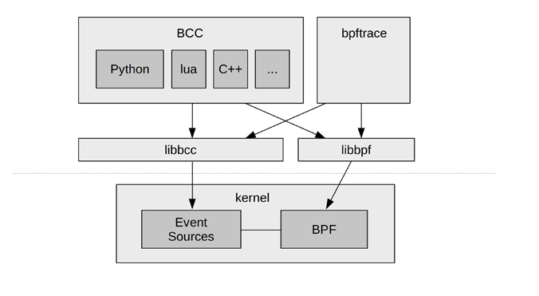
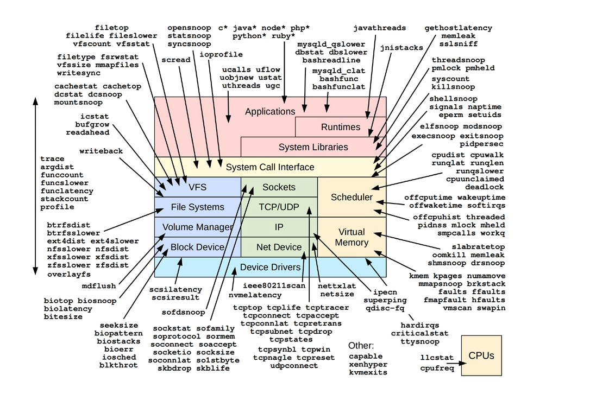

Following summary is extracted from Chapter 1 of [BPF Performance Tools: Linux System and Application Observability](http://www.brendangregg.com/bpf-performance-tools-book.html).

**NOTE**: Most of this summary are full quotes from the book; all diagrams are copied from the book.

# What is BPF

> BPF provides a way to run mini programs on a wide variety of kernel and application events, allowing kernel to run mini programs on system and application events such as disk I/O.

# BCC, BPFTRACE and IO Visor

BCC & BPF: both are high-level framework for building BPF tools; BCC are for more complex tools whereas BPF are for one-liners

> BPF can be considered a virtual machine due to its virtual instruction set specification, which are exercuted by a Linux kernel BPF runtime. This BPF runtime includes an interpreter and a JIT compiler for turning BPF instructions into native instructions for execution.

> BCC and bpftrace do not live in the kernel code but in a github project IO Visor.

# Analysis techniques

| Technique | Meaning                                                                                                                                | Tools                       |
| --------- | -------------------------------------------------------------------------------------------------------------------------------------- | --------------------------- |
| Tracing   | Record raw events and event metadata                                                                                                   | BPF tools, strace, tcdpdump |
| Sampling  | paint a picture using a subset of measurement, aka creating a profile or profiling - like tracer but only collect regularly data point | profile                     |

# Whatever You're Into, BPF's Got You Covered

# Dynamic Instrumentation

> BPF tracing supports multiple sources of events to provide visibility of the entire software stack. One of which is dynamic instrumentation (aka dynamic tracing) - the ability to insert instrumentation points into live software, in production. It costs zero overhead when not in use as software runs unmodified; is often used by BPF tools to instrument the start and aend of kernel and application functions.

> Linux's dynamic instrumentation for user-level and kernekl-level functions are `uprobes` and `kprobes` respectively.

# Static Instrumentation

Problem with dynanic instrumentation: function names may change which breaks instrumentation.

Solve: use static instrumentation, which means developer must maintain the event names in the software's code.
